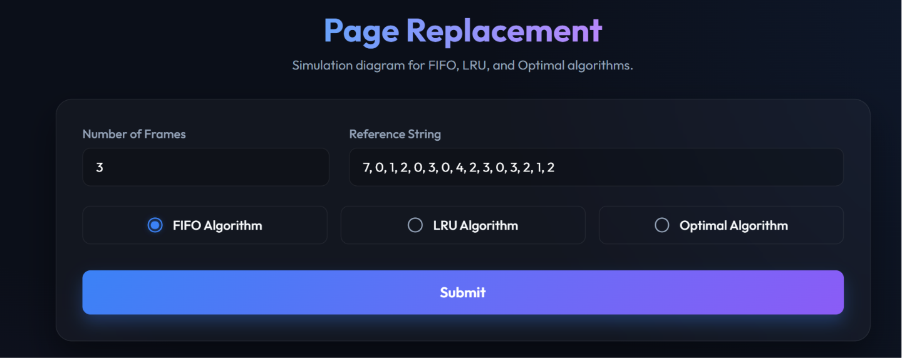
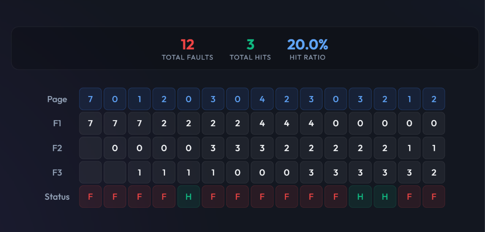
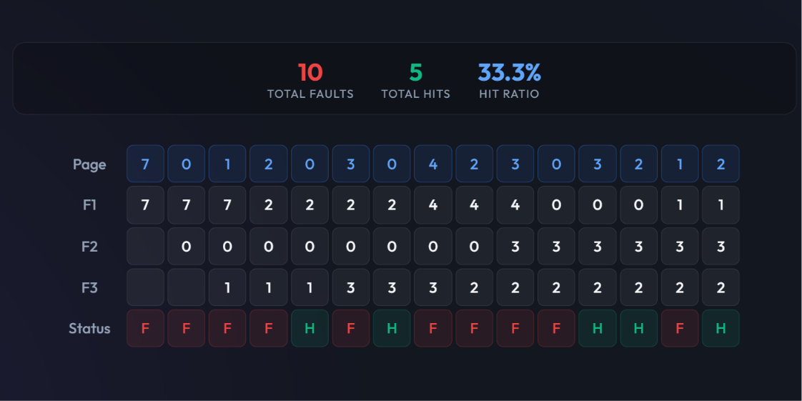
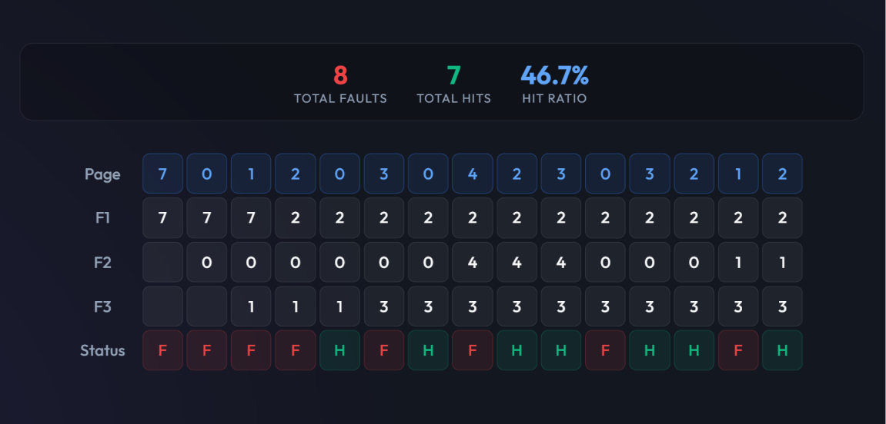

# 🖥️ Page Replacement Algorithm Simulator

An interactive web-based simulator for classic **Operating System page replacement algorithms** — built with a **Java** backend (for algorithm logic) and a **Node.js/Express** frontend server.

---

## 📌 Project Overview

This project visually simulates how an OS manages memory frames when pages are requested. It implements three core page replacement strategies:

| Algorithm | Description |
|-----------|-------------|
| **FIFO** | Replaces the page that has been in memory the longest. |
| **LRU** | Replaces the page that was least recently used. |
| **Optimal** | Replaces the page that won't be used for the longest time in the future. |

The simulation outputs a step-by-step **CRT-style diagram** showing which pages are in frames at each step, along with hit/fault statistics.

---

## 🗂️ Project Structure

```
os project/
├── Algo.java          # Java program implementing FIFO, LRU, and Optimal algorithms
├── Algo.class         # Compiled Java bytecode
├── server.js          # Node.js/Express server that calls the Java program via CLI
├── package.json       # Node.js dependencies
├── public/
│   └── index.html     # Frontend UI (HTML + CSS + JS)
└── README.md          # Project documentation
```

---

## ✅ Prerequisites

Before running this project, ensure you have the following installed:

- **Java JDK** (version 8 or higher) — [Download JDK](https://www.oracle.com/java/technologies/downloads/)
- **Node.js** (version 14 or higher) — [Download Node.js](https://nodejs.org/)
- **npm** (comes with Node.js)

Verify installations:
```bash
java -version
node -version
npm -version
```

---

## 🚀 Getting Started

### 1. Clone or Download the Project

```bash
git clone <your-repo-url>
cd "os project"
```

### 2. Install Node.js Dependencies

```bash
npm install
```

### 3. Compile the Java Program

> This step is **required** before starting the server.

```bash
javac Algo.java
```

### 4. Start the Server

```bash
node server.js
```

### 5. Open in Browser

Navigate to: [http://localhost:3000](http://localhost:3000)

---

## 🎮 How to Use

1. **Enter the number of frames** (memory slots available to the OS).
2. **Enter a reference string** — a comma-separated list of page numbers (e.g., `7, 0, 1, 2, 0, 3, 0, 4`).
3. **Select an algorithm**: FIFO, LRU, or Optimal.
4. Click **Submit** to run the simulation.
5. View the animated step-by-step CRT table showing:
   - Pages in each frame at every step
   - **H** (Hit) or **F** (Fault) at each step
   - Total Faults, Total Hits, and Hit Ratio

---

## 🛠️ How It Works

### Architecture

```
Browser (index.html)
      │
      │  POST /api/run  { algorithm, frames, referenceString }
      ▼
Node.js Server (server.js)
      │
      │  Spawns child process: java Algo <args>
      ▼
Java Program (Algo.java)
      │
      │  Outputs JSON result
      ▼
Node.js Server → Browser (renders CRT diagram)
```

### Java Program (`Algo.java`)

Takes command-line arguments:
```
java Algo <algoType> <numFrames> <numPages> <page1> <page2> ...
```
- `algoType`: `1` = FIFO, `2` = LRU, `3` = Optimal
- Returns a JSON object with `totalFaults` and step-by-step `frames` state.

---

## 📊 Example

**Input:**
- Frames: `3`
- Reference String: `7, 0, 1, 2, 0, 3, 0, 4, 2, 3, 0, 3, 2, 1, 2`
- Algorithm: `FIFO`

**Output (sample):**
```
Total Faults: 9 | Total Hits: 6 | Hit Ratio: 40.0%
```

---

## 🔧 Troubleshooting

| Problem | Solution |
|---------|----------|
| `Error running Java program` | Make sure you ran `javac Algo.java` first |
| `Cannot find module 'express'` | Run `npm install` |
| Port 3000 already in use | Change the port in `server.js` line 44 |
| `java` not recognized | Add Java JDK `bin` folder to your system PATH |

---

## 👩‍💻 Technologies Used

- **Java** — Algorithm logic (FIFO, LRU, Optimal)
- **Node.js + Express** — Backend server & API
- **HTML5 / CSS3 / JavaScript** — Frontend UI
- **Google Fonts (Outfit)** — Typography

---

## 📖 Concepts Covered (OS Topics)

- **Page Replacement Algorithms** (a core concept in OS memory management)
- **Demand Paging**
- **Page Faults vs. Page Hits**
- **Belady's Anomaly** (observable with FIFO)

---
## 📸 Screenshots

### Home Page



### FIFO



### LRU



### Optimal




